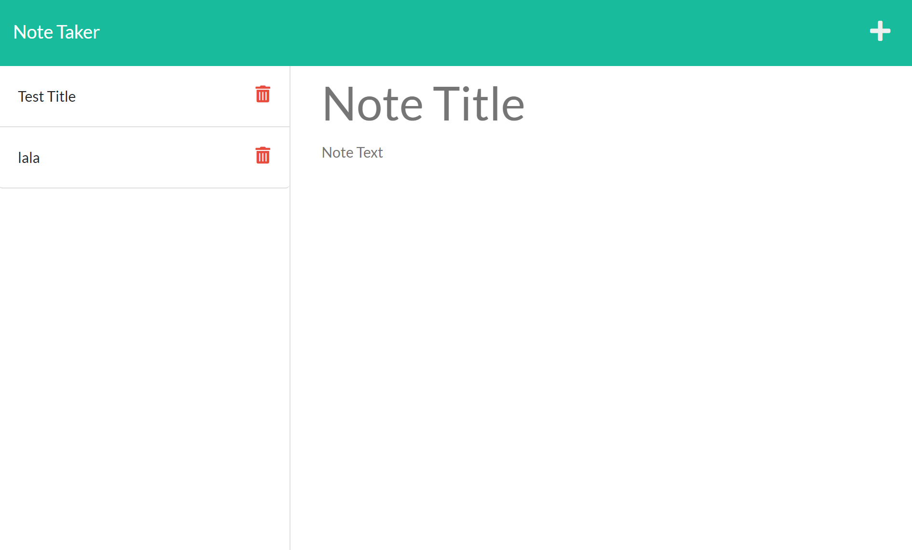

# Note-Taker

## About the Project
With the Note Taker application, you can easily create notes by clicking the plus button and adding whatever content you choose. To save a note, you'll click on the save icon button and notice that your note pops up on the left hand sidebar. If you wish to delete a note, click on the trashcan icon button and watch your note dissapear from the sidebar. Happy notetaking!  

## Project Preview

## Project Link
[Note-Taker](https://estilbee-note-taker.herokuapp.com/)

## Technologies Used
- HTML
- CSS
- JavaScript
- Node.Js